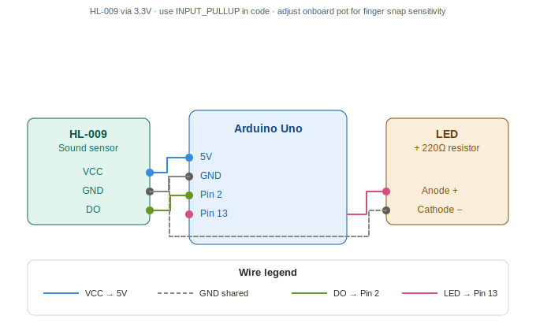
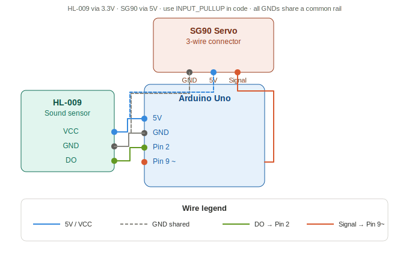

# arduino-sound-controlled-actuators

Control LEDs and servo motors using sound gestures (clap or finger snap) with an Arduino Uno and HL-009 sound sensor. Includes two beginner-friendly embedded systems projects with clean, well-documented code.

---

## Projects

| Project | Description |
|---|---|
| `clap_led.ino` | Toggle an LED ON/OFF using a clap or finger snap |
| `clap_led_servo.ino` | Toggle an LED + sweep a servo motor using a clap or finger snap |

---

## Hardware Required

| Component | Quantity |
|---|---|
| Arduino Uno | 1 |
| HL-009 Sound Sensor | 1 |
| SG90 Servo Motor | 1 |
| LED (any color) | 1 |
| 220Ω Resistor | 1 |
| Breadboard | 1 |
| Jumper Wires | As needed |

---

## Project 1 — Clap LED (`clap_led.ino`)

### Description
A clap or finger snap toggles an LED ON or OFF. Uses edge detection and debouncing to ensure reliable single-trigger response even in noisy environments.

### Pin Connections



| HL-009 Pin | Arduino Pin |
|---|---|
| VCC | 3.3V |
| GND | GND |
| DO | Digital Pin 2 |

| LED | Arduino Pin |
|---|---|
| Anode (+) via 220Ω | Digital Pin 13 |
| Cathode (−) | GND |


### Behavior
- **Clap / Snap once** → LED turns ON
- **Clap / Snap again** → LED turns OFF

---

## Project 2 — Clap LED + Servo (`clap_led_servo.ino`)

### Description
A clap or finger snap simultaneously toggles an LED and sweeps a servo motor between 0° and 180°. Both actuators share a single state variable so they are always in sync. The LED responds instantly while the servo sweeps smoothly degree by degree.

### Pin Connections



| HL-009 Pin | Arduino Pin |
|---|---|
| VCC | 3.3V |
| GND | GND |
| DO | Digital Pin 2 |

| SG90 Servo Wire | Arduino Pin |
|---|---|
| Brown (GND) | GND |
| Red (VCC) | 5V |
| Orange (Signal) | Digital Pin 9 (~PWM) |

| LED | Arduino Pin |
|---|---|
| Anode (+) via 220Ω | Digital Pin 13 |
| Cathode (−) | GND |

### Behavior
- **Clap / Snap once** → Servo sweeps to 180° + LED turns ON
- **Clap / Snap again** → Servo sweeps to 0° + LED turns OFF

---

## Sensitivity Adjustment

The HL-009 sound sensor has an onboard potentiometer to adjust detection sensitivity.

- **Turn clockwise** → increases sensitivity (picks up softer sounds like finger snaps)
- **Turn counter-clockwise** → decreases sensitivity (only triggers on loud sounds like claps)

Use a small Phillips screwdriver to adjust. Test using the Arduino Serial Monitor (9600 baud) to see real-time trigger feedback.

---

## Key Concepts Used

- **Edge detection** — Detects the moment sound transitions from HIGH → LOW for accurate single-trigger response
- **Debouncing** — 300ms cooldown prevents a single sound from registering multiple times
- **State toggling** — Single boolean variable keeps LED and servo perfectly in sync
- **Smooth servo sweep** — Servo moves degree by degree instead of jumping, using configurable delay
- **INPUT_PULLUP** — Used on the sound sensor pin to ensure reliable reads when sensor is powered via 3.3V

---

## How to Use

1. Clone this repository
```bash
git clone https://github.com/yash-wase/arduino-sound-controlled-actuators.git
```

2. Open the desired `.ino` file in the **Arduino IDE**

3. Connect components as per the pin connection tables above

4. Select **Board:** Arduino Uno and correct **Port** from Tools menu

5. Upload the code

6. Open **Serial Monitor** at **9600 baud** to see live trigger logs

7. Adjust the HL-009 potentiometer until your preferred sound gesture triggers reliably

---

## Troubleshooting

| Issue | Fix |
|---|---|
| LED / servo not triggering | Increase sensor sensitivity using potentiometer |
| Multiple triggers per clap | Increase `DEBOUNCE_MS` value in code (try 400–500) |
| Servo jittering randomly | Power servo from external 5V, not Arduino's 5V pin |
| Arduino resetting during sweep | Servo drawing too much current — use external power |
| No Serial Monitor output | Check baud rate is set to 9600 |

---

## File Structure

```
arduino-sound-controlled-actuators/
│
├── clap_led/
│   └── clap_led.ino
│
├── clap_led_servo/
│   └── clap_led_servo.ino
│
└── README.md
```

---

## Author

**Yash Yogesh Wase**
- GitHub: [@yash-wase](https://github.com/yash-wase)
- LinkedIn: [yash-wase](https://www.linkedin.com/in/yash-wase)

---

## License

This project is open source and available under the [MIT License](LICENSE).
